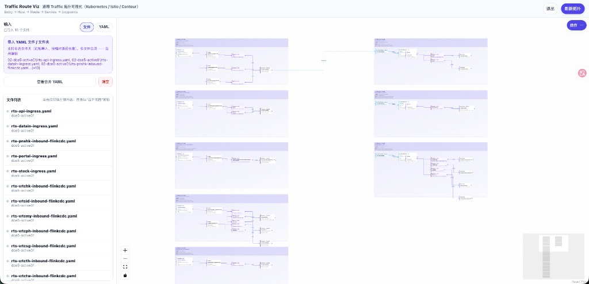
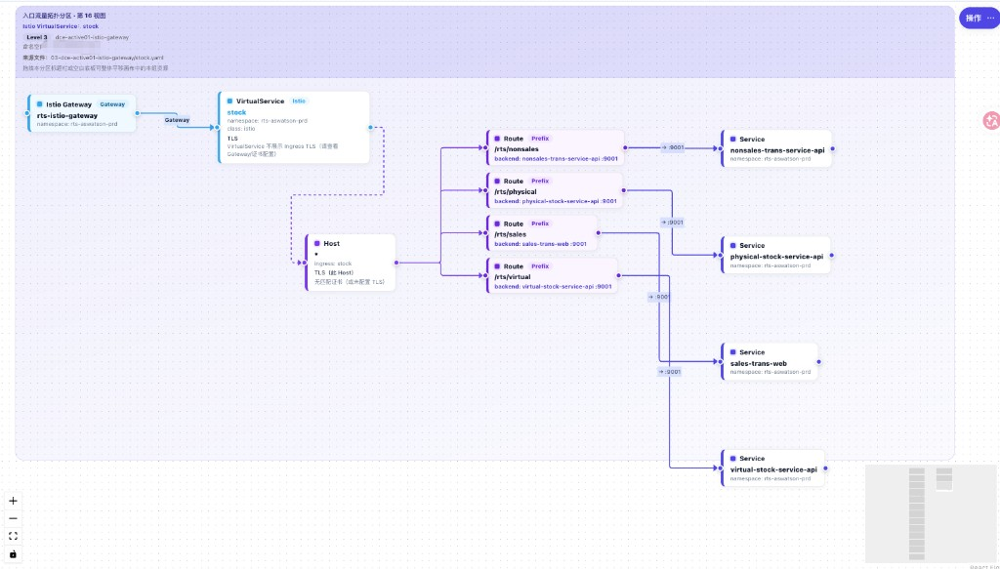

# Traffic Route Viz（流量路由可视化）/ traffic-route-viz

把 YAML 里的流量链路“看得见、拖得动、可导出”：从入口对象一路追踪到后端 Service 与 Endpoints（Pod IP），用一张图把路由关系讲清楚。

- **适用场景**：排查线上路由、做变更评审、交接系统依赖、复盘事故影响面
- **核心路径**：Ingress / VirtualService / Contour Gateway → Host → Route → Service → Endpoints
- **开箱即用**：多文件/文件夹导入、区域分区（Area）、手写连线、PNG/Mermaid/draw.io 导出、会话保存/打开

## Screenshots

截图素材在 `docs/media/`。





## Features

### Import & parsing

- **多文档 YAML**：支持 `---` 分隔
- **多文件 / 文件夹导入**：点击选择 + 拖拽；支持多次追加导入并按相对路径去重
- **来源绑定**：Area 标题显示来源文件（用于审计/回溯）

### Supported resources (current)

- Kubernetes：**Ingress / Service / Endpoints**
- Istio：**VirtualService / DestinationRule（subsets 显示在 Service 上）**
- Contour：**HTTPProxy（Contour Gateway）**

### Visualization & UX

- **Area/Region 分区**：每个入口对象一个可拖拽分区底板（避免归属混淆）
- **手写连线**：支持手动拉线（灰色虚线）；刷新解析后仍保留有效手写边
- **专业工作台交互**：顶部状态条（节点/边/手写边统计 + 最近刷新状态）、节点搜索与逐个定位、类型筛选高亮
- **高辨识度设计**：节点与边按语义配色，自动边带箭头
- **Example 分层布局**：导入路径包含 `01-* / 02-* / 03-*` 时自动三列泳道（01 左、02 中、03 右；同列 1 行 1 Area；Active01 在 Active02 上）

### Export & persistence

- **导出 PNG**
- **导出 Mermaid / draw.io**
- **保存/打开会话文件**：`*.traffic-viz.json`（含 YAML 上下文 + nodes/edges + viewport + 手写边）

### Security (simple)

- **强制登录（可运行时配置）**：通过站点根目录 `/config.json` 控制（K8s 可用 ConfigMap 挂载）

## Quickstart

```bash
cd web
pnpm install --ignore-scripts
pnpm run dev
```

在页面左侧粘贴 YAML 或拖拽/选择多个 YAML 文件，图表会自动刷新。

## Docs

- **规格/验收（单一事实来源）**：`HARNESS_ENGINEERING.md`
- **运行/协作手册**：`PROJECT_GUIDE.md`
- **发布指南**：`DEPLOYMENT.md`

## Deploy

- 发布入口见：`DEPLOYMENT.md`
  - Docker：`web/Dockerfile`（多阶段构建，Nginx 托管；SPA fallback + `/config.json` no-store）
  - K8s：参考 `DEPLOYMENT.md` 与 `HARNESS_ENGINEERING.md`（“登录与发布”章节）

## Tools

- `tools/export-ingress-services.sh`：导出某个 namespace 下的 Ingress 及其关联 Service（按 Ingress 分文件），并生成 `./<namespace>/ingress.tar.gz`（包含 `manifests/`）。
- `tools/export-istio-vs-destinationrules.sh`：导出某个 namespace 下的 VirtualService，并把匹配的 DestinationRule 一起写入同名 YAML（多文档 `---`）；默认输出到 `./<namespace>/istio/` 并生成 `./<namespace>/istio.tar.gz`（包含 `istio/`）。如需适配 01/02/03 分层导入，可显式指定 `--out-root traffic/example --tier 02 --group <namespace>-istio`。

## Project docs

- `HARNESS_ENGINEERING.md`：工程规格与验收标准（单一事实来源）
- `PROJECT_GUIDE.md`：项目运行/协作手册（目录、命令、已知陷阱）
- `AGENTS.md`：多 Agent 切换/交接入口
- `docs/UX_OPTIMIZATION_2026-05.md`：本轮 UI/UX 深度优化设计、实现与测试沉淀

## Repo layout

- `traffic/`：示例/真实导出的 K8s YAML（本地可忽略提交）
- `tools/`：辅助脚本
- `web/`：前端可视化应用（Vite + React + React Flow）
