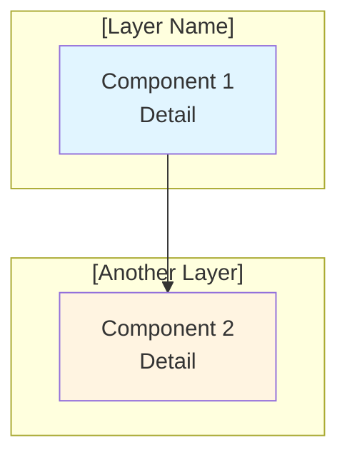
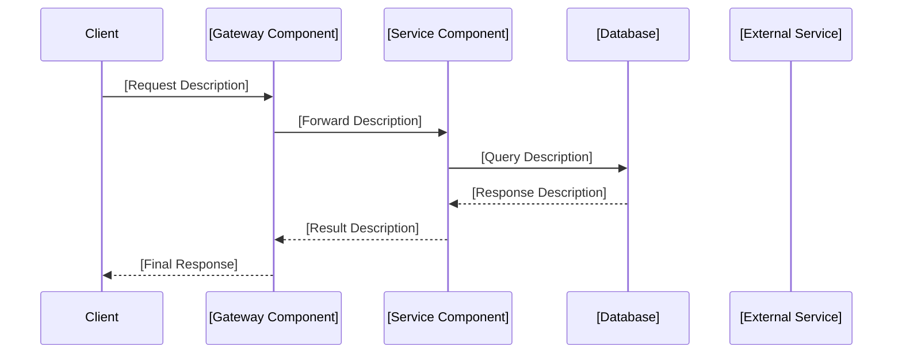

# Baseline & GAP Analysis - [PROJECT_TITLE]

<!-- ==============================================================================
     INSTRUCTION: SPEC CODING TEMPLATE - GAP ANALYSIS
     ==============================================================================
     This template is designed for infrastructure and platform engineering projects.
     It documents the current state (baseline), identifies gaps between current
     and desired state, evaluates implementation options, and provides a structured
     recommendation with a migration path.

     HOW TO USE THIS TEMPLATE:
     1. Replace all [PLACEHOLDER] markers with project-specific content.
     2. Remove or adapt sections that do not apply to your project.
     3. Follow the inline comments (<!-- INSTRUCTION: ... -->) for guidance.
     4. Keep the severity rating system consistent:
        - 🔴 CRITICAL  = Blocks delivery; must be resolved before proceeding
        - 🟡 HIGH      = Required but not immediately blocking; plan to address
        - 🟢 MEDIUM    = Important but can be deferred or handled incrementally
     5. Use ✅ for existing assets and ❌ for missing items.
     ============================================================================ -->

**Document ID**: GAP_[PROJECT_NAME]
<!-- INSTRUCTION: Use a short, uppercase, underscore-separated identifier.
     Example: GAP_ALB_Fargate_java_service, GAP_1928_pipeline_improvement -->

**Issue**: #[ISSUE_NUMBER] - [Issue Title]
<!-- INSTRUCTION: Reference the GitHub/Jira issue number and its title.
     Example: #1880 - ALB + Fargate Infrastructure for Java Container Deployment -->

**Created**: [DATE]
<!-- INSTRUCTION: Use the date this document was first created.
     Example: 2025-01-15 -->

**Branch**: [BRANCH_NAME]
<!-- INSTRUCTION: The feature branch where implementation work will occur.
     Example: feature/1880-alb-fargate-java-card-service -->

**Status**: Baseline Assessment & Gap Analysis
<!-- INSTRUCTION: Track document lifecycle:
     - "Baseline Assessment & Gap Analysis" (initial)
     - "Analysis Phase" (under review)
     - "DECISION MADE - [Approach Name] SELECTED" (after decision)
     - "Implementation In Progress" (during build)
     - "Complete" (after delivery) -->

**Dependencies**: #[ISSUE_NUMBER] ([Dependency Description])
<!-- INSTRUCTION: List any prerequisite issues or related work.
     Remove this section if there are no dependencies.
     Example: #1843 (PostgreSQL Cluster Infrastructure) -->

---

## Executive Summary

<!-- INSTRUCTION: This section must be readable in under 2 minutes by a
     technical lead or engineering manager. Include only the most critical
     information needed to understand scope, gaps, and direction. -->

### Current Baseline Status: [EMOJI] **[OVERALL_STATUS_DESCRIPTION]**

<!-- INSTRUCTION: Provide a percentage-based assessment of each major
     capability area. Use an appropriate emoji indicator:
     - 🟢 = Fully ready / 80-100%
     - 🟡 = Partially ready / 20-79%
     - 🔴 = Not ready / 0-19%
     - ✅ = Already exists (100%)
     Example below: -->

- **[Capability Area 1]**: [PERCENTAGE]% ([Brief status note])
- **[Capability Area 2]**: [PERCENTAGE]% ([Brief status note])
- **[Capability Area 3]**: 0% ([Brief status note])
- **[Capability Area 4]**: 0% ([Brief status note])
- **[Capability Area 5]**: 0% ([Brief status note])

### Key Findings

<!-- INSTRUCTION: Number each finding. Use ✅ for existing assets that can be
     leveraged and ❌ for missing items that must be built. Start with
     strengths (what exists) before listing gaps (what is missing). -->

1. ✅ **[Existing Asset Name]**: [Description of what exists and how it helps]
2. ✅ **[Existing Asset Name]**: [Description of what exists and how it helps]
3. ✅ **[Existing Asset Name]**: [Description of what exists and how it helps]
4. ❌ **[Missing Capability Name]**: [Description of what is missing]
5. ❌ **[Missing Capability Name]**: [Description of what is missing]
6. ❌ **[Missing Capability Name]**: [Description of what is missing]
7. ❌ **[Missing Capability Name]**: [Description of what is missing]
8. ❌ **[Missing Capability Name]**: [Description of what is missing]

### Critical Gap: [GAP_TITLE]

<!-- INSTRUCTION: State the central gap in one sentence. Then describe what
     the requirement asks for and what the options are. -->

**Requirement** (Issue #[ISSUE_NUMBER]): [One-sentence description of what is required].

<!-- INSTRUCTION: If multiple approaches are being considered, document each
     as a sub-section below. If only one approach exists, still describe it
     but omit the "not selected" framing. -->

#### Option A: [Option Name] (Considered but Not Selected)
- **[Key Characteristic]**: [Description]
- **Benefits**: [List key benefits]
- **Not Selected**: [State why this approach was not chosen]

#### Option B: [Option Name] ✅ **SELECTED**

<!-- INSTRUCTION: If the decision is already made, mark it with the
     ✅ **SELECTED** marker and describe the chosen approach. If no
     decision has been made yet, present all options neutrally. -->

**[Approach Focus]**:
- **[Component 1]**: [Description]
- **[Component 2]**: [Description]
- **[Component 3]**: [Description]
- **[Component 4]**: [Description]

**Benefits**:
- ✅ [Benefit 1]
- ✅ [Benefit 2]
- ✅ [Benefit 3]

**✅ Decision Made**: [Option Name] approach selected for implementation

---

## Section 0: Architecture Comparison

<!-- INSTRUCTION: This section provides visual architecture diagrams comparing
     the current state with each proposed option. Use ASCII diagrams for
     quick readability and Mermaid diagrams for detailed flows. Both formats
     are acceptable; choose based on audience needs.
     - ASCII: Works everywhere, no rendering required
     - Mermaid: Better for complex diagrams with styling (requires renderer) -->

### 0.1 Current Architecture ([Current Architecture Name])

<!-- INSTRUCTION: Draw an ASCII diagram of the current system architecture.
     Use boxes (┌────┐), arrows (│, ▼, →), and labels. Keep the diagram
     readable in a monospace font at standard terminal width (~80 chars). -->

```
┌─────────────────────────────────────────────────────────────┐
│                    [Component 1 Name]                        │
│              [Component 1 Detail / Endpoint]                 │
└───────────────────────┬─────────────────────────────────────┘
                        │
                        ▼
        ┌───────────────────────────────┐
        │   [Component 2 Name]         │
        │   - [Detail 1]               │
        │   - [Detail 2]               │
        └───────────────┬───────────────┘
                        │
        ┌───────────────┴───────────────┐
        │                               │
        ▼                               ▼
┌───────────────┐              ┌───────────────┐
│  [Service A]  │              │  [Service B]  │
│  [Detail]     │              │  [Detail]     │
└───────────────┘              └───────────────┘
```

### 0.2 Option A: [Option Name] Architecture

<!-- INSTRUCTION: If this option was considered, provide a diagram showing
     the proposed architecture. Include multi-environment isolation if
     applicable (dev, test, staging, prod). -->

<!-- INSTRUCTION: Mermaid diagram example (uncomment if preferred):


-->

```
┌─────────────────────────────────────────────────────────────┐
│                    [Proposed Component 1]                    │
│              [Proposed Component 1 Detail]                   │
└───────────────────────┬─────────────────────────────────────┘
                        │
                        ▼
        ┌───────────────────────────────┐
        │   [Proposed Component 2]     │
        │   [Detail]                   │
        └───────────────┬───────────────┘
                        │
                        ▼
        ┌───────────────────────────────┐
        │   [Proposed Component 3]     │
        │   [Detail]                   │
        └───────────────┬───────────────┘
                        │
        ┌───────────────┴───────────────┐
        │                               │
        ▼                               ▼
┌───────────────┐              ┌───────────────┐
│  [Data Store] │              │  [External]   │
│  [Detail]     │              │  [Detail]     │
└───────────────┘              └───────────────┘
```

<!-- INSTRUCTION: If the project supports multiple environments (dev, test,
     staging, prod), include an environment isolation diagram here showing
     how each environment is separated. Example:

**Environment Isolation Architecture**:

```
┌───────────────────────────────────────────────────────┐
│         [Component]                                    │
│                                                        │
│  Environment Isolation:                               │
│  ┌─────────┐  ┌─────────┐  ┌─────────┐  ┌─────────┐ │
│  │   dev   │  │  test   │  │ staging │  │   prod  │ │
│  └─────────┘  └─────────┘  └─────────┘  └─────────┘ │
└───────────────────────────────────────────────────────┘
```
-->

### 0.3 Option B: [Option Name] Architecture

<!-- INSTRUCTION: Repeat the diagram pattern for Option B if applicable.
     If only one option exists, remove this sub-section entirely. -->

```
[Architecture diagram for Option B - same format as 0.2]
```

**Data Flow** (Request -> Response):

<!-- INSTRUCTION: A sequence diagram is useful for showing how data flows
     through the system. Use Mermaid sequenceDiagram for this.


-->

---

## Section 1: Current Architecture Baseline

<!-- INSTRUCTION: This is the core of the GAP analysis. Break the current
     system into logical components. For each component:
     1. Show what EXISTS (with actual code snippets from the codebase)
     2. List what is MISSING (as bullet points with ❌ markers)
     3. Assign a GAP SEVERITY rating

     The sub-sections below are examples. Adapt them to match the actual
     components in your project. Common infrastructure components include:
     API Gateway, Lambda, ALB, ECS/Fargate, Networking/VPC, Security Groups,
     IAM Roles, Monitoring, CI/CD, Database, etc. -->

### 1.1 [Component 1 Name] Configuration

<!-- INSTRUCTION: Example component - adapt or replace with your actual
     component names. Common examples:
     - API Gateway Configuration
     - Lambda Functions Baseline
     - Application Load Balancer Infrastructure
     - ECS Fargate Infrastructure
     - Java Container Implementation
     - VPC / Networking Configuration -->

#### ✅ EXISTING ASSETS

<!-- INSTRUCTION: Show actual code from the codebase. Include file paths
     in parentheses so reviewers can locate the source. Use fenced code
     blocks with the appropriate language tag. -->

**[Configuration/Setup Name]** (`[relative/file/path]`):
```[language]
# [Description of what this code does]
[actual or representative code snippet]
```

**[Component] Features**:
- ✅ [Feature 1 - with brief description]
- ✅ [Feature 2 - with brief description]
- ✅ [Feature 3 - with brief description]

#### ❌ MISSING [COMPONENT NAME]

<!-- INSTRUCTION: List each missing item with ❌. Be specific about what
     exactly is absent. Group related items together. -->

```bash
# [Component Name] (SEVERITY LEVEL GAP)
- ❌ No [specific missing item 1]
- ❌ No [specific missing item 2]
- ❌ No [specific missing item 3]
- ❌ No [specific missing item 4]
- ❌ No [specific missing item 5]
```

**GAP SEVERITY**: 🔴 **CRITICAL** - [Brief justification for severity]
<!-- INSTRUCTION: Use one of three severity levels:
     - 🔴 CRITICAL  - Blocks delivery; no workaround exists
     - 🟡 HIGH      - Required but workaround or reference exists
     - 🟢 MEDIUM    - Important but deferrable or incremental -->

### 1.2 [Component 2 Name]

#### ✅ EXISTING REFERENCE IMPLEMENTATION ([Reference Project Name])

<!-- INSTRUCTION: If another project or module already implements what is
     needed, document it as a "reference implementation". Show the actual
     code so the implementer knows what to adapt. -->

**[Reference Project] Setup** (`[relative/file/path]`):
```hcl
# [Component] Configuration
resource "aws_[resource_type]" "[name]" {
  [configuration block]
}
```

**[Reference Project] Features** (Can be referenced):
- ✅ [Feature that can be reused]
- ✅ [Feature that can be reused]
- ✅ [Feature that can be reused]

#### ❌ MISSING [TARGET COMPONENT NAME]

```bash
# [Target Component Name] (SEVERITY LEVEL GAP)
- ❌ No [specific missing item 1]
- ❌ No [specific missing item 2]
- ❌ No [specific missing item 3]
- ❌ No [specific missing item 4]
```

**GAP SEVERITY**: 🟡 **HIGH** - [Brief justification]

### 1.3 [Component 3 Name]

#### ✅ EXISTING [IMPLEMENTATION NAME]

**Current [Component] Structure**:
```
[path/to/directory]/
├── [file1.ext]           # [Description]
├── [file2.ext]           # [Description]
├── [subdirectory]/
│   ├── [file3.ext]       # [Description]
│   └── [file4.ext]       # [Description]
└── [config.ext]          # [Description]
```

**[Component] Features**:
- ✅ [Feature 1]
- ✅ [Feature 2]
- ✅ [Feature 3]

#### ❌ MISSING [TARGET COMPONENT]

```bash
# [Target Component] (SEVERITY LEVEL GAP)
- ❌ No [specific missing item 1]
- ❌ No [specific missing item 2]
- ❌ No [specific missing item 3]
```

**GAP SEVERITY**: 🔴 **CRITICAL** - [Brief justification]

### 1.4 [Component 4 Name] - Integration Layer

#### ✅ EXISTING INTEGRATION

**Current Integration**:
- [Description of current integration point]
- [Description of how components connect today]

#### ❌ MISSING [INTEGRATION COMPONENT]

```bash
# [Integration Component] (SEVERITY LEVEL GAP)
- ❌ No [specific missing item 1]
- ❌ No [specific missing item 2]
- ❌ No [specific missing item 3]
```

<!-- INSTRUCTION: If there are multiple integration approaches,
     list them as sub-items with brief descriptions. -->

**Integration Options**:

**Option 1: [Integration Approach Name]**
- [Brief description]
- [Trade-off]

**Option 2: [Integration Approach Name]**
- [Brief description]
- [Trade-off]

**GAP SEVERITY**: 🔴 **CRITICAL** - [Brief justification]

---

## Section 2: [Option] Analysis

<!-- INSTRUCTION: Provide a detailed comparison of the implementation
     options. If only one approach is being pursued, frame this section
     as a "Detailed Analysis" of that approach rather than a comparison. -->

### 2.1 [Option] Feature Analysis

#### ✅ [CAPABILITY AREA]

**[Feature Category]**:
- ✅ [Capability 1 - with detail]
- ✅ [Capability 2 - with detail]
- ✅ [Capability 3 - with detail]
- ✅ [Capability 4 - with detail]

#### ❌ MISSING [CAPABILITY AREA]

```bash
# [Capability Area] (SEVERITY LEVEL GAP)
- ❌ No [specific missing item 1]
- ❌ No [specific missing item 2]
- ❌ No [specific missing item 3]
```

**GAP SEVERITY**: 🔴 **CRITICAL** - [Brief justification]

### 2.2 Comparative Analysis

<!-- INSTRUCTION: Use a comparison table when evaluating multiple options.
     Each row should represent a distinct evaluation dimension.
     Include a clear recommendation row at the bottom. -->

| Aspect | [Option A Name] | [Option B Name] |
|--------|-----------------|-----------------|
| **Infrastructure Complexity** | [Low/Medium/High] - [Detail] | [Low/Medium/High] - [Detail] |
| **[Integration Type]** | [Description] | [Description] |
| **Performance** | [Description] | [Description] |
| **Cost (Low Traffic)** | [Description] | [Description] |
| **Cost (High Traffic)** | [Description] | [Description] |
| **Scaling** | [Description] | [Description] |
| **Implementation Time** | [Faster/Slower] - [Detail] | [Faster/Slower] - [Detail] |

**Recommendation**: [Brief recommendation sentence with rationale].

### 2.3 [Option] Implementation GAPs

<!-- INSTRUCTION: Break down the gaps for the chosen option into
     sub-categories. Use the severity rating system consistently. -->

#### [Sub-category 1] (e.g., ECR Repository, Terraform Modules)
```bash
# [Sub-category Name] ([SEVERITY] GAP)
- ❌ No [specific missing item 1]
- ❌ No [specific missing item 2]
- ❌ No [specific missing item 3]
```

#### [Sub-category 2] (e.g., Container Image, Java Project)
```bash
# [Sub-category Name] ([SEVERITY] GAP)
- ❌ No [specific missing item 1]
- ❌ No [specific missing item 2]
- ❌ No [specific missing item 3]
```

#### [Sub-category 3] (e.g., VPC Configuration, Security Groups)
```bash
# [Sub-category Name] ([SEVERITY] GAP)
- ❌ No [specific missing item 1]
- ❌ No [specific missing item 2]
- ❌ No [specific missing item 3]
```

#### [Sub-category 4] (e.g., Database Integration, Connection Pooling)
```bash
# [Sub-category Name] ([SEVERITY] GAP)
- ❌ No [specific missing item 1]
- ❌ No [specific missing item 2]
- ❌ No [specific missing item 3]
```

#### [Sub-category 5] (e.g., CI/CD Configuration, Pipeline)
```bash
# [Sub-category Name] ([SEVERITY] GAP)
- ❌ No [specific missing item 1]
- ❌ No [specific missing item 2]
- ❌ No [specific missing item 3]
```

---

## Section 3: Infrastructure GAP Analysis

<!-- INSTRUCTION: Analyze the infrastructure-level gaps across
     cross-cutting concerns. These are typically the non-functional
     requirements that support the primary components. -->

### 3.1 Networking Infrastructure

#### ✅ EXISTING NETWORKING

**VPC Configuration** (from [reference source]):
- ✅ [Existing networking component 1]
- ✅ [Existing networking component 2]
- ✅ [Existing networking component 3]

#### ❌ MISSING [NETWORKING COMPONENT]

```bash
# [Networking Component] ([SEVERITY] GAP)
- ❌ No [specific missing item 1]
- ❌ No [specific missing item 2]
- ❌ No [specific missing item 3]
```

**GAP SEVERITY**: 🟡 **HIGH** - [Brief justification]

### 3.2 Security Configuration

#### ✅ EXISTING SECURITY PATTERNS

**[Reference Project] Security** (reference):
- ✅ [Existing security pattern 1]
- ✅ [Existing security pattern 2]
- ✅ [Existing security pattern 3]

#### ❌ MISSING [SECURITY COMPONENT]

```bash
# [Security Component] ([SEVERITY] GAP)
- ❌ No [specific missing item 1]
- ❌ No [specific missing item 2]
- ❌ No [specific missing item 3]
```

**GAP SEVERITY**: 🟡 **HIGH** - [Brief justification]

### 3.3 IAM Roles and Permissions

#### ✅ EXISTING IAM PATTERNS

**[Current System] IAM** (current):
- ✅ [Existing permission 1]
- ✅ [Existing permission 2]
- ✅ [Existing permission 3]

**[Reference Project] IAM** (reference):
- ✅ [Existing permission 4]
- ✅ [Existing permission 5]

#### ❌ MISSING [IAM COMPONENT]

```bash
# [IAM Component] ([SEVERITY] GAP)
- ❌ No [specific missing item 1]
- ❌ No [specific missing item 2]
- ❌ No [specific missing item 3]
```

**GAP SEVERITY**: 🟡 **HIGH** - [Brief justification]

### 3.4 Monitoring and Logging

#### ✅ EXISTING MONITORING

**[Current System] Monitoring**:
- ✅ [Existing monitoring 1]
- ✅ [Existing monitoring 2]
- ✅ [Existing monitoring 3]

#### ❌ MISSING [MONITORING COMPONENT]

```bash
# [Monitoring Component] ([SEVERITY] GAP)
- ❌ No [specific missing item 1]
- ❌ No [specific missing item 2]
- ❌ No [specific missing item 3]
```

**GAP SEVERITY**: 🟢 **MEDIUM** - [Brief justification]

### 3.5 Auto-Scaling Configuration

<!-- INSTRUCTION: Include this section if the project involves
     container orchestration or auto-scaling. Remove if not applicable. -->

#### ✅ EXISTING AUTO-SCALING PATTERNS

**[Reference Project] Auto-Scaling** (reference):
- ✅ [Existing auto-scaling pattern 1]
- ✅ [Existing auto-scaling pattern 2]
- ✅ [Existing auto-scaling pattern 3]

#### ❌ MISSING [AUTO-SCALING COMPONENT]

```bash
# [Auto-Scaling Component] ([SEVERITY] GAP)
- ❌ No [specific missing item 1]
- ❌ No [specific missing item 2]
- ❌ No [specific missing item 3]
```

**GAP SEVERITY**: 🟢 **MEDIUM** - [Brief justification]

---

## Section 4: Implementation GAP Analysis

<!-- INSTRUCTION: Analyze gaps in the implementation toolchain:
     Terraform, CI/CD, configuration management, etc. -->

### 4.1 Terraform Infrastructure Code

#### ✅ EXISTING TERRAFORM MODULES

**Reference Modules**:
- ✅ `[path/to/reference/module/]` - [Description of what it provides]
- ✅ `[path/to/another/module/]` - [Description]

#### ❌ MISSING [TERRAFORM COMPONENT]

```bash
# [Terraform Component] ([SEVERITY] GAP)
- ❌ No [specific missing item 1]
- ❌ No [specific missing item 2]
- ❌ No [specific missing item 3]
```

**GAP SEVERITY**: 🔴 **CRITICAL** - [Brief justification]

### 4.2 CI/CD Pipeline

#### ✅ EXISTING CI/CD PATTERNS

**Current Deployment**:
- ✅ [Existing pipeline step 1]
- ✅ [Existing pipeline step 2]
- ✅ [Existing pipeline step 3]

#### ❌ MISSING [CI/CD COMPONENT]

```bash
# [CI/CD Component] ([SEVERITY] GAP)
- ❌ No [specific missing item 1]
- ❌ No [specific missing item 2]
- ❌ No [specific missing item 3]
```

**GAP SEVERITY**: 🟡 **HIGH** - [Brief justification]

### 4.3 Configuration Management

#### ✅ EXISTING CONFIGURATION

**Current Configuration**:
- ✅ [Existing config mechanism 1]
- ✅ [Existing config mechanism 2]
- ✅ [Existing config mechanism 3]

#### ❌ MISSING [CONFIGURATION COMPONENT]

```bash
# [Configuration Component] ([SEVERITY] GAP)
- ❌ No [specific missing item 1]
- ❌ No [specific missing item 2]
- ❌ No [specific missing item 3]
```

**GAP SEVERITY**: 🟢 **MEDIUM** - [Brief justification]

---

## Section 5: Migration Path Analysis

<!-- INSTRUCTION: Provide a phase-by-phase implementation plan for
     each option being considered. Each phase should contain concrete,
     ordered steps. Use ✅ markers for steps (indicating "this is a
     required step to complete"), not to indicate completion status. -->

### 5.1 Option A: [Option Name] Migration Path

**Phase 1: Infrastructure Setup**
1. ✅ [Step 1 description]
2. ✅ [Step 2 description]
3. ✅ [Step 3 description]
4. ✅ [Step 4 description]
5. ✅ [Step 5 description]

**Phase 2: [Service/Application] Development**
1. ✅ [Step 1 description]
2. ✅ [Step 2 description]
3. ✅ [Step 3 description]
4. ✅ [Step 4 description]
5. ✅ [Step 5 description]

**Phase 3: Integration**
1. ✅ [Step 1 description]
2. ✅ [Step 2 description]
3. ✅ [Step 3 description]
4. ✅ [Step 4 description]

**Phase 4: Testing and Validation**
1. ✅ [Step 1 description]
2. ✅ [Step 2 description]
3. ✅ [Step 3 description]
4. ✅ [Step 4 description]
5. ✅ [Step 5 description]

**Phase 5: Optimization**
1. ✅ [Step 1 description]
2. ✅ [Step 2 description]
3. ✅ [Step 3 description]
4. ✅ [Step 4 description]

### 5.2 Option B: [Option Name] Migration Path

<!-- INSTRUCTION: Repeat the phase structure for Option B. If only
     one option is being pursued, remove this sub-section and rename
     5.1 to "Migration Path" without the Option A prefix. -->

### 5.3 Current State -> Target State

<!-- INSTRUCTION: Provide a simple before/after architecture comparison
     to make the migration direction clear. -->

**Current Architecture**:
```
[Component A]
    |
    v
[Component B]
    |
    v
[Component C]
```

**Target Architecture**:
```
[Component A]
    |
    v
[NEW Component X]
    |
    v
[Component C (modified)]
```

### 5.4 Migration Steps (Detailed)

<!-- INSTRUCTION: Provide the detailed step sequence for the selected
     approach. These should be actionable, ordered tasks. -->

#### Phase 1: Infrastructure Setup
1. ✅ [Step with specific file path or resource name]
2. ✅ [Step with specific file path or resource name]
3. ✅ [Step with specific file path or resource name]
4. ✅ [Step with specific file path or resource name]
5. ✅ [Step with specific file path or resource name]

#### Phase 2: Service Development
1. ✅ [Step with specific deliverable]
2. ✅ [Step with specific deliverable]
3. ✅ [Step with specific deliverable]
4. ✅ [Step with specific deliverable]

#### Phase 3: Integration
1. ✅ [Step with specific integration point]
2. ✅ [Step with specific integration point]
3. ✅ [Step with specific integration point]
4. ✅ [Step with specific integration point]

#### Phase 4: Deployment and Testing
1. ✅ [Step with specific test or deployment action]
2. ✅ [Step with specific test or deployment action]
3. ✅ [Step with specific test or deployment action]
4. ✅ [Step with specific test or deployment action]
5. ✅ [Step with specific test or deployment action]

#### Phase 5: Migration and Cleanup
1. ✅ [Step with specific cutover action]
2. ✅ [Step with specific monitoring action]
3. ✅ [Step with specific decommission action]
4. ✅ [Step with specific cleanup action]

---

## Section 6: Risk Assessment

<!-- INSTRUCTION: Identify risks and pair each with a concrete mitigation
     strategy. Separate into High Risk and Medium Risk categories.
     High Risk items could delay delivery or cause production incidents.
     Medium Risk items are concerning but manageable. -->

### 6.1 High Risk Areas

1. **[Risk Area 1 Name]**
   - **Risk**: [Specific description of what could go wrong]
   - **Mitigation**: [Specific action to prevent or recover from the risk]

2. **[Risk Area 2 Name]**
   - **Risk**: [Specific description of what could go wrong]
   - **Mitigation**: [Specific action to prevent or recover from the risk]

3. **[Risk Area 3 Name]**
   - **Risk**: [Specific description of what could go wrong]
   - **Mitigation**: [Specific action to prevent or recover from the risk]

4. **[Risk Area 4 Name]**
   - **Risk**: [Specific description of what could go wrong]
   - **Mitigation**: [Specific action to prevent or recover from the risk]

### 6.2 Medium Risk Areas

1. **[Risk Area 5 Name]**
   - **Risk**: [Specific description of what could go wrong]
   - **Mitigation**: [Specific action to prevent or recover from the risk]

2. **[Risk Area 6 Name]**
   - **Risk**: [Specific description of what could go wrong]
   - **Mitigation**: [Specific action to prevent or recover from the risk]

3. **[Risk Area 7 Name]**
   - **Risk**: [Specific description of what could go wrong]
   - **Mitigation**: [Specific action to prevent or recover from the risk]

---

## Section 7: Recommendations

<!-- INSTRUCTION: State the final recommendation clearly with the
     ✅ DECISION MADE marker if a decision has been reached. Provide
     numbered rationale points and a priority-ordered implementation plan. -->

### 7.1 Selected Approach: [Option Name] ✅ **DECISION MADE**

<!-- INSTRUCTION: If no decision has been made, replace the marker with:
     "**PROPOSED** (Pending Review)" -->

**Decision**: [Option Name] approach has been selected for implementation.

**Rationale**:
1. ✅ **[Rationale Point 1]**: [Explanation]
2. ✅ **[Rationale Point 2]**: [Explanation]
3. ✅ **[Rationale Point 3]**: [Explanation]
4. ✅ **[Rationale Point 4]**: [Explanation]
5. ✅ **[Rationale Point 5]**: [Explanation]

**Implementation Priority**:
1. **High**: [Component or task that must be done first]
2. **High**: [Component or task that must be done first]
3. **High**: [Component or task that must be done first]
4. **Medium**: [Component or task that should follow]
5. **Low**: [Component or task that can be deferred]

### 7.2 Alternative Approach: [Option Name] - Not Selected

<!-- INSTRUCTION: Document the considered-but-not-selected approach
     so future readers understand why it was rejected. -->

**Rationale**:
1. ✅ **[Strength of this approach]**: [Explanation]
2. ✅ **[Strength of this approach]**: [Explanation]
3. ✅ **[Strength of this approach]**: [Explanation]

**[Option Name] was considered but not selected**:
- [Reason 1 why it was not chosen]
- [Reason 2 why it was not chosen]
- [Reason 3 why it was not chosen]

**Implementation Priority** (if reconsidered):
1. **High**: [What would need to be done first]
2. **High**: [What would need to be done first]
3. **Medium**: [What would follow]
4. **Low**: [What could be deferred]

### 7.3 Hybrid Approach (If Applicable)

<!-- INSTRUCTION: Include this section only if a hybrid approach
     combining elements of multiple options is viable. Remove if
     not applicable. -->

**Consider Hybrid If**:
- ✅ [Condition where hybrid makes sense 1]
- ✅ [Condition where hybrid makes sense 2]
- ✅ [Condition where hybrid makes sense 3]

**Example**:
- **[Option A]**: [Use for which components/workloads]
- **[Option B]**: [Use for which components/workloads]

---

## Section 8: Success Criteria

<!-- INSTRUCTION: Define clear, testable success criteria for each
     implementation option. Use markdown checkboxes (- [ ]) so
     criteria can be tracked during implementation. Organize by
     category: Infrastructure, Integration, Service/Performance. -->

### 8.1 Option A: [Option Name] Success Criteria

**Infrastructure**:
- [ ] [Infrastructure criterion 1]
- [ ] [Infrastructure criterion 2]
- [ ] [Infrastructure criterion 3]
- [ ] [Infrastructure criterion 4]
- [ ] [Infrastructure criterion 5]

**Integration**:
- [ ] [Integration criterion 1]
- [ ] [Integration criterion 2]
- [ ] [Integration criterion 3]
- [ ] [Integration criterion 4]
- [ ] [Integration criterion 5]

**Performance**:
- [ ] [Performance criterion 1]
- [ ] [Performance criterion 2]
- [ ] [Performance criterion 3]
- [ ] [Performance criterion 4]

### 8.2 Option B: [Option Name] Success Criteria

**Infrastructure**:
- [ ] [Infrastructure criterion 1]
- [ ] [Infrastructure criterion 2]
- [ ] [Infrastructure criterion 3]
- [ ] [Infrastructure criterion 4]
- [ ] [Infrastructure criterion 5]

**Integration**:
- [ ] [Integration criterion 1]
- [ ] [Integration criterion 2]
- [ ] [Integration criterion 3]
- [ ] [Integration criterion 4]

**Service**:
- [ ] [Service criterion 1]
- [ ] [Service criterion 2]
- [ ] [Service criterion 3]
- [ ] [Service criterion 4]
- [ ] [Service criterion 5]

---

## Section 9: Dependencies

<!-- INSTRUCTION: List all external and internal dependencies.
     Mark existing dependencies with ✅ and new dependencies that
     need to be created with ❌. -->

### 9.1 External Dependencies

- **[Service/Tool 1]**: [Status: existing/new] - [Description]
- **[Service/Tool 2]**: [Status: existing/new] - [Description]
- **[Service/Tool 3]**: [Status: existing/new] - [Description]
- **[Service/Tool 4]**: [Status: existing/new] - [Description]

### 9.2 Internal Dependencies

- ✅ **[Internal Component 1]**: [Status] - [Description]
- ✅ **[Internal Component 2]**: [Status] - [Description]
- ❌ **[Internal Component 3]**: [Status] - [Description]
- ❌ **[Internal Component 4]**: [Status] - [Description]

### 9.3 Reference Implementations

<!-- INSTRUCTION: List specific file paths to code that implementers
     should reference when building the solution. -->

- **[Reference Name 1]**: `[relative/path/to/reference/code/]`
- **[Reference Name 2]**: `[relative/path/to/reference/code/]`
- **[Reference Name 3]**: `[relative/path/to/reference/code/]`

---

## Section 10: Next Steps

<!-- INSTRUCTION: Categorize next steps by time horizon. Each step
     should be a concrete, actionable item with an owner if possible. -->

### 10.1 Immediate Actions

1. **[Action 1 Title]**
   - [Specific task description]
   - [Expected outcome]

2. **[Action 2 Title]**
   - [Specific task description]
   - [Expected outcome]

3. **[Action 3 Title]**
   - [Specific task description]
   - [Expected outcome]

### 10.2 Short-term Actions

1. **[Action 4 Title]**
   - [Specific task description]
   - [Expected outcome]

2. **[Action 5 Title]**
   - [Specific task description]
   - [Expected outcome]

3. **[Action 6 Title]**
   - [Specific task description]
   - [Expected outcome]

### 10.3 Long-term Actions

1. **[Action 7 Title]**
   - [Specific task description]
   - [Expected outcome]

2. **[Action 8 Title]**
   - [Specific task description]
   - [Expected outcome]

3. **[Action 9 Title]**
   - [Specific task description]
   - [Expected outcome]

---

## Related Documentation

<!-- INSTRUCTION: Link to any supporting documents, previous analyses,
     or external references. Use relative paths for internal docs
     and full URLs for external resources. -->

- **[Document Name 1]**: `[relative/path/to/document.md]`
- **[Document Name 2]**: `[relative/path/to/document.md]`
- **[Document Name 3]**: `[relative/path/to/document.md]`
- **GitHub Issue**: #[ISSUE_NUMBER] - [Issue URL]

---

**Document Version**: 1.0
**Last Updated**: [DATE]
**Changes**: [Description of changes in this version]
**Next Review**: [When this document should next be reviewed]
<!-- INSTRUCTION: Track document history. Increment version with each
     significant update. Example:
     Version 1.0 - Initial GAP analysis
     Version 2.0 - Added Option B analysis, updated architecture diagrams
     Version 3.0 - Decision finalized, migration path confirmed -->
