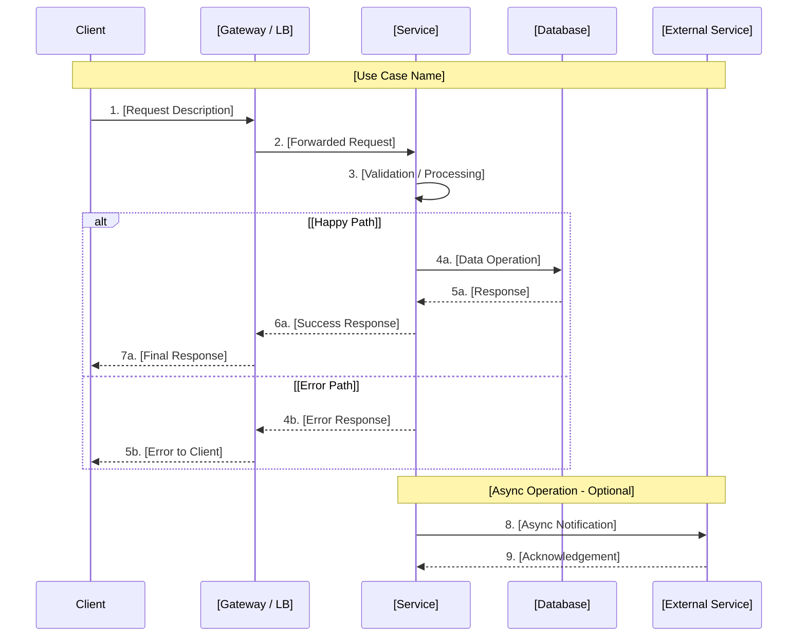
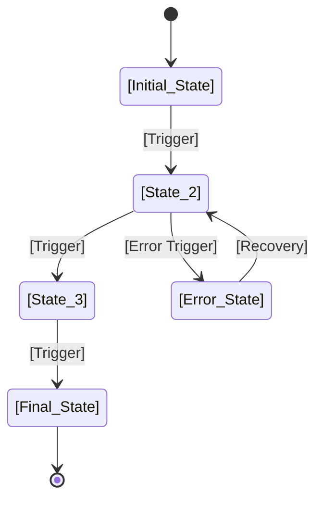

# Feature Implementation Plan - [PROJECT_TITLE]

<!-- ==============================================================================
     INSTRUCTION: SPEC CODING TEMPLATE - FEATURE IMPLEMENTATION PLAN (FIP)
     ==============================================================================
     This template is designed for infrastructure and platform engineering projects.
     It captures the complete technical design, implementation strategy, risk
     assessment, and rollout plan for a feature or system component. Use this
     AFTER requirements are finalized and architecture decisions are made.

     HOW TO USE THIS TEMPLATE:
     1. Replace all [PLACEHOLDER] markers with project-specific content.
     2. Remove or adapt sections that do not apply to your project.
     3. Follow the inline comments (<!-- INSTRUCTION: ... -->) for guidance.
     4. Keep the severity rating system consistent:
        - 🔴 CRITICAL  = Blocks delivery; must be resolved before proceeding
        - 🟡 HIGH      = Required but not immediately blocking; plan to address
        - 🟢 MEDIUM    = Important but can be deferred or handled incrementally
     5. Use ✅ for completed items and ❌ for pending items.
     6. All Mermaid diagrams render in GitHub and most Markdown viewers.
     7. Target audience: engineers implementing the feature and reviewers
        approving the design.
     ============================================================================ -->

**Document ID**: FIP_[PROJECT_NAME]
<!-- INSTRUCTION: Use a short, uppercase, underscore-separated identifier.
     Example: FIP_ALB_Fargate_java_service, FIP_1928_pipeline_improvement -->

**Issue**: #[ISSUE_NUMBER] - [Issue Title]
<!-- INSTRUCTION: Reference the GitHub/Jira issue number and its title.
     Example: #1880 - ALB + Fargate Infrastructure for Java Container Deployment -->

**Created**: [DATE]
<!-- INSTRUCTION: Use the date this document was first created.
     Example: 2025-01-15 -->

**Branch**: [BRANCH_NAME]
<!-- INSTRUCTION: The feature branch where implementation work will occur.
     Example: feature/1880-alb-fargate-java-card-service -->

**Status**: [DOCUMENT_STATUS]
<!-- INSTRUCTION: Track document lifecycle:
     - "Draft" (initial creation)
     - "Under Review" (peer review phase)
     - "Approved" (design sign-off received)
     - "Implementation In Progress" (build phase)
     - "Complete" (after delivery) -->

**Author**: [AUTHOR_NAME]
<!-- INSTRUCTION: Primary author responsible for this document.
     Example: arthurren -->

**Reviewers**: [REVIEWER_1], [REVIEWER_2]
<!-- INSTRUCTION: List engineers or leads who should review this FIP.
     Example: alice, bob, charlie -->

---

## Executive Summary

<!-- INSTRUCTION: This section must be readable in under 2 minutes by a
     technical lead or engineering manager. Provide enough context for
     a reader to understand WHAT is being built, WHY, and the key risks
     without reading the full document. -->

### Overview

[PROJECT_TITLE] implements [BRIEF_DESCRIPTION_OF_FEATURE]. This feature addresses [PROBLEM_STATEMENT] by [HIGH_LEVEL_SOLUTION_APPROACH]. The implementation spans [NUMBER] components across [ENVIRONMENTS] environments and is targeted for delivery by [TARGET_DATE].

<!-- INSTRUCTION: Write 2-4 sentences that answer:
     - What is being built?
     - Why is it needed (business/technical justification)?
     - How will it be built (high-level approach)?
     - When is it expected to be delivered? -->

### Key Technical Decisions

<!-- INSTRUCTION: Document the most important technical decisions made
     during the design phase. Each row should capture a decision that
     would be costly to reverse. Limit to 5-8 decisions. -->

| Decision | Options Considered | Selected | Rationale |
|----------|-------------------|----------|-----------|
| [Decision 1: e.g., Compute Platform] | [Option A, Option B, Option C] | [Selected Option] | [Why this was chosen over alternatives] |
| [Decision 2: e.g., Data Store] | [Option A, Option B] | [Selected Option] | [Why this was chosen over alternatives] |
| [Decision 3: e.g., Networking Model] | [Option A, Option B] | [Selected Option] | [Why this was chosen over alternatives] |
| [Decision 4: e.g., Auth Mechanism] | [Option A, Option B] | [Selected Option] | [Why this was chosen over alternatives] |
| [Decision 5: e.g., Deployment Strategy] | [Option A, Option B] | [Selected Option] | [Why this was chosen over alternatives] |

### Risk Assessment Summary

<!-- INSTRUCTION: Provide a quick-glance view of the top risks. These
     should map to detailed entries in Section 5. Use severity indicators
     consistently. Limit to 5-7 rows. -->

| Risk | Severity | Mitigation | Status |
|------|----------|------------|--------|
| [Risk 1 Description] | 🔴 CRITICAL | [Brief mitigation strategy] | [Open / Mitigated / Accepted] |
| [Risk 2 Description] | 🟡 HIGH | [Brief mitigation strategy] | [Open / Mitigated / Accepted] |
| [Risk 3 Description] | 🟡 HIGH | [Brief mitigation strategy] | [Open / Mitigated / Accepted] |
| [Risk 4 Description] | 🟢 MEDIUM | [Brief mitigation strategy] | [Open / Mitigated / Accepted] |
| [Risk 5 Description] | 🟢 MEDIUM | [Brief mitigation strategy] | [Open / Mitigated / Accepted] |

---

## Section 1: Architecture Design

<!-- INSTRUCTION: This section provides the complete technical architecture
     for the feature. Diagrams are REQUIRED. Use Mermaid for detailed
     architecture and ASCII for simpler component views. Ensure all
     components mentioned in later sections are visible here. -->

### 1.1 System Architecture

<!-- INSTRUCTION: Provide a high-level Mermaid diagram showing all major
     system components and their relationships. Include external
     dependencies, data stores, and network boundaries. Use subgraphs
     to group related components. -->

```mermaid
graph TB
    subgraph "Client Layer"
        CL[Client / SDK<br/>[Description]]
    end

    subgraph "Network Layer"
        NLB[Network Load Balancer<br/>[Description]]
        ALB[Application Load Balancer<br/>[Description]]
    end

    subgraph "Compute Layer"
        SVC[Service / Container<br/>[Description]]
        WORKER[Worker / Background<br/>[Description]]
    end

    subgraph "Data Layer"
        DB[(Database<br/>[Type])]
        CACHE[(Cache<br/>[Type])]
        S3[Object Store<br/>[Description]]
    end

    subgraph "External Services"
        EXT[External API<br/>[Description]]
        AUTH[Auth Provider<br/>[Description]]
    end

    CL --> NLB
    NLB --> ALB
    ALB --> SVC
    SVC --> DB
    SVC --> CACHE
    SVC --> S3
    SVC --> EXT
    SVC --> AUTH
    WORKER --> DB
    WORKER --> CACHE

    style CL fill:#e1f5ff
    style NLB fill:#fff4e1
    style ALB fill:#fff4e1
    style SVC fill:#e8f5e9
    style WORKER fill:#e8f5e9
    style DB fill:#fce4ec
    style CACHE fill:#fce4ec
    style S3 fill:#fce4ec
    style EXT fill:#f3e5f5
    style AUTH fill:#f3e5f5
```

### 1.2 Component Architecture

<!-- INSTRUCTION: Provide an ASCII diagram of the internal component
     structure. This should show how modules, packages, or services
     relate to each other within the system boundary. Keep the diagram
     readable at standard terminal width (~80 chars). -->

```
┌─────────────────────────────────────────────────────────────┐
│                    [System Name]                             │
│                                                              │
│  ┌──────────────┐  ┌──────────────┐  ┌──────────────┐       │
│  │ [Module A]   │  │ [Module B]   │  │ [Module C]   │       │
│  │ [Detail]     │  │ [Detail]     │  │ [Detail]     │       │
│  └──────┬───────┘  └──────┬───────┘  └──────┬───────┘       │
│         │                 │                 │                │
│         └────────┬────────┘─────────────────┘                │
│                  │                                           │
│                  ▼                                           │
│         ┌────────────────┐                                   │
│         │ [Core Module]  │                                   │
│         │ [Detail]       │                                   │
│         └───────┬────────┘                                   │
│                 │                                             │
│         ┌───────┴────────┐                                   │
│         │                │                                   │
│         ▼                ▼                                   │
│  ┌──────────────┐  ┌──────────────┐                         │
│  │ [Adapter A]  │  │ [Adapter B]  │                         │
│  │ [Detail]     │  │ [Detail]     │                         │
│  └──────────────┘  └──────────────┘                         │
└─────────────────────────────────────────────────────────────┘
```

### 1.3 Data Flow

<!-- INSTRUCTION: Provide a Mermaid sequence diagram showing how data
     flows through the system for the primary use case. Include error
     paths if they are architecturally significant. Number the steps
     for easy reference in later sections. -->



### 1.4 API Design

<!-- INSTRUCTION: Define all API endpoints for this feature. Include
     the HTTP method, path, a brief description, authentication
     requirements, and whether the endpoint is idempotent. Add or
     remove rows as needed. -->

| Method | Path | Description | Auth | Idempotent |
|--------|------|-------------|------|------------|
| GET | `/api/v1/[resource]` | [List resources] | [Auth Type] | Yes |
| GET | `/api/v1/[resource]/{id}` | [Get single resource] | [Auth Type] | Yes |
| POST | `/api/v1/[resource]` | [Create resource] | [Auth Type] | No |
| PUT | `/api/v1/[resource]/{id}` | [Update resource] | [Auth Type] | Yes |
| PATCH | `/api/v1/[resource]/{id}` | [Partial update] | [Auth Type] | No |
| DELETE | `/api/v1/[resource]/{id}` | [Delete resource] | [Auth Type] | Yes |
| POST | `/api/v1/[resource]/{id}/[action]` | [Custom action] | [Auth Type] | No |

<!-- INSTRUCTION: For complex APIs, add sub-sections for each endpoint
     with request/response JSON schemas. Example:

#### POST /api/v1/[resource]
**Request**: `{"field1": "[TYPE]", "field2": "[TYPE]"}`
**Response 200**: `{"id": "[TYPE]", "field1": "[TYPE]", "created_at": "[TIMESTAMP]"}`
-->

---

## Section 2: Detailed Design

<!-- INSTRUCTION: This section contains the detailed design for each
     component in the system. Provide enough detail that an engineer
     can implement the component without additional design sessions.
     Each component should have its own sub-section. Add or remove
     component sub-sections as needed. -->

### 2.1 [Component 1 Name] Design

<!-- INSTRUCTION: Replace [Component 1 Name] with the name of the
     primary component (e.g., "API Gateway", "Data Processor",
     "Terraform Module"). This should be the most complex or
     architecturally significant component. -->

#### Class / Module Diagram

<!-- INSTRUCTION: Provide a Mermaid class diagram showing the internal
     structure of this component. Include key classes, their attributes,
     methods, and relationships. -->

```mermaid
classDiagram
    class [ClassName1] {
        +[attribute1]: [type]
        +[attribute2]: [type]
        +[method1](params): [return_type]
        +[method2](params): [return_type]
    }

    class [ClassName2] {
        +[attribute1]: [type]
        +[method1](params): [return_type]
    }

    class [InterfaceName] {
        <<interface>>
        +[method1](params): [return_type]
    }

    [ClassName1] --> [ClassName2] : [relationship]
    [ClassName1] ..|> [InterfaceName] : implements
```

#### Configuration

<!-- INSTRUCTION: Provide the configuration schema for this component.
     Use the appropriate format (YAML, JSON, TOML, HCL) based on the
     technology stack. Include inline comments explaining each field. -->

```yaml
# [Component 1] Configuration
component_1:
  name: "[INSTANCE_NAME]"
  # INSTRUCTION: Describe each configuration field below

  # [Field Description]
  enabled: [true|false]

  # [Field Description] - Valid range: [MIN]-[MAX]
  retry_count: [NUMBER]

  # [Field Description] - Format: [TIME_FORMAT]
  timeout: "[DURATION]"

  # [Field Description]
  endpoints:
    - name: "[ENDPOINT_NAME]"
      url: "[ENDPOINT_URL]"
      # INSTRUCTION: Health check configuration
      health_check:
        interval: "[DURATION]"
        timeout: "[DURATION]"
        healthy_threshold: [NUMBER]
        unhealthy_threshold: [NUMBER]
```

#### Error Handling

<!-- INSTRUCTION: Define the error handling strategy for this component.
     Document error codes, recovery actions, and escalation paths.
     Use a table for structured error code definitions. -->

| Error Code | Description | Recovery Action | Escalation |
|------------|-------------|-----------------|------------|
| `[ERR_CODE_1]` | [Error description] | [Automatic recovery steps] | [When to escalate] |
| `[ERR_CODE_2]` | [Error description] | [Automatic recovery steps] | [When to escalate] |
| `[ERR_CODE_3]` | [Error description] | [Automatic recovery steps] | [When to escalate] |

<!-- INSTRUCTION: Describe the general error handling pattern:

**Error Handling Pattern**:
- [Retry strategy: exponential backoff, circuit breaker, etc.]
- [Fallback behavior when retries are exhausted]
- [Logging and alerting for unrecoverable errors]
-->

### 2.2 [Component 2 Name] Design

<!-- INSTRUCTION: Replace [Component 2 Name] with the name of the
     second major component (e.g., "Database Layer", "Queue Processor",
     "Auth Module"). -->

#### Interface Definition

<!-- INSTRUCTION: Define the public interface for this component.
     This could be an API contract, a function signature set, or
     a protocol specification. Other components depend on this
     interface, so it must be stable and well-documented. -->

```
Interface: [InterfaceName]

Methods:
  [method_name](param1: [type], param2: [type]) -> [return_type]
    Description: [What this method does]
    Preconditions: [What must be true before calling]
    Postconditions: [What is guaranteed after calling]
    Raises: [Exception types]

  [method_name](param1: [type]) -> [return_type]
    Description: [What this method does]
    Preconditions: [What must be true before calling]
    Postconditions: [What is guaranteed after calling]
    Raises: [Exception types]
```

#### State Management

<!-- INSTRUCTION: Describe how this component manages state.
     This is critical for understanding consistency guarantees,
     failure modes, and recovery behavior. -->

- **State Type**: [Stateless / Stateful / Hybrid]
- **Persistence**: [In-memory / Database / File / None]
- **Consistency Model**: [Strong / Eventual / Causal]
- **State Transitions**:

<!-- INSTRUCTION: If the component has significant state transitions,
     provide a Mermaid state diagram:


-->

### 2.3 [Component 3 Name] Design

<!-- INSTRUCTION: Replace [Component 3 Name] with the name of the
     third major component. If your system has more or fewer than
     three components, add or remove sub-sections accordingly.
     Follow the same pattern as 2.1 and 2.2: interface, configuration,
     and error handling details. -->

[Detailed design content for Component 3 - follow the same pattern as 2.1 and 2.2]

---

## Section 3: Security Design

<!-- INSTRUCTION: Security must be considered from the start, not
     bolted on at the end. This section documents the security
     measures built into the design. All entries should be reviewed
     by a security-conscious engineer. -->

### 3.1 Authentication & Authorization

<!-- INSTRUCTION: Describe how users and services authenticate to
     this system and what they are authorized to do. -->

- **Authentication Method**: [e.g., OAuth 2.0, IAM Roles, API Keys, mTLS]
- **Authorization Model**: [e.g., RBAC, ABAC, ACL]
- **Token Management**: [e.g., JWT with rotation, session tokens]
- **Service-to-Service Auth**: [e.g., IAM roles, service accounts]

**Role Definitions**:

| Role | Permissions | Scope |
|------|-------------|-------|
| [Role 1] | [List of permissions] | [Scope description] |
| [Role 2] | [List of permissions] | [Scope description] |
| [Role 3] | [List of permissions] | [Scope description] |

### 3.2 Data Protection

<!-- INSTRUCTION: Describe how data is protected at rest and in
     transit. Include encryption standards, key management,
     and data classification. -->

- **Data in Transit**: [e.g., TLS 1.2+, mTLS between services]
- **Data at Rest**: [e.g., AES-256, AWS KMS managed keys]
- **PII Handling**: [e.g., Field-level encryption, tokenization]
- **Data Retention**: [e.g., 90 days for logs, 7 years for audit]
- **Data Classification**: [e.g., Public, Internal, Confidential, Restricted]

### 3.3 Secret Management

<!-- INSTRUCTION: Describe how secrets (API keys, passwords,
     certificates) are stored, rotated, and accessed. -->

- **Secret Store**: [e.g., AWS Secrets Manager, HashiCorp Vault]
- **Rotation Policy**: [e.g., 90-day automatic rotation]
- **Access Pattern**: [e.g., IAM role-based, service account]
- **Audit Trail**: [e.g., CloudTrail logging for all secret access]

### 3.4 Security Checklist

<!-- INSTRUCTION: Complete this checklist during design review.
     Mark each item as ✅ (addressed), ❌ (not addressed), or
     🟡 (partially addressed). All ❌ items must have a plan
     before implementation begins. -->

| Item | Status | Notes |
|------|--------|-------|
| Input validation on all endpoints | [STATUS] | [Notes or N/A] |
| Output encoding to prevent injection | [STATUS] | [Notes or N/A] |
| Authentication on all protected routes | [STATUS] | [Notes or N/A] |
| Authorization checks per operation | [STATUS] | [Notes or N/A] |
| TLS for all network communication | [STATUS] | [Notes or N/A] |
| Encryption at rest for sensitive data | [STATUS] | [Notes or N/A] |
| Secrets not in source code | [STATUS] | [Notes or N/A] |
| Rate limiting on public endpoints | [STATUS] | [Notes or N/A] |
| Logging of security events | [STATUS] | [Notes or N/A] |
| Dependency vulnerability scanning | [STATUS] | [Notes or N/A] |
| Least-privilege IAM policies | [STATUS] | [Notes or N/A] |
| Network segmentation applied | [STATUS] | [Notes or N/A] |

---

## Section 4: Performance Design

<!-- INSTRUCTION: Document performance requirements and the design
     decisions made to meet them. Be specific with numbers --
     vague targets like "fast" or "responsive" are not actionable. -->

### 4.1 Performance Requirements

<!-- INSTRUCTION: Define measurable performance targets. Each metric
     should have a target value, a measurement method, and an
     acceptance criterion. -->

| Metric | Target | Measurement Method | Acceptance |
|--------|--------|--------------------|------------|
| API Response Time (p50) | [e.g., < 100ms] | [e.g., CloudWatch latency] | [e.g., Must meet 99% of requests] |
| API Response Time (p99) | [e.g., < 500ms] | [e.g., CloudWatch latency] | [e.g., Must meet 99% of requests] |
| Throughput | [e.g., 1000 req/s] | [e.g., Load test with k6] | [e.g., Sustained for 5 min] |
| Database Query Time | [e.g., < 50ms] | [e.g., Query execution logs] | [e.g., 95th percentile] |
| Cold Start Time | [e.g., < 2s] | [e.g., Container startup logs] | [e.g., First request ready] |
| Memory Usage | [e.g., < 512MB] | [e.g., Container metrics] | [e.g., Under normal load] |
| CPU Usage (steady state) | [e.g., < 40%] | [e.g., CloudWatch CPU] | [e.g., Average over 1 hour] |

### 4.2 Caching Strategy

<!-- INSTRUCTION: Describe where caching is used, what is cached,
     invalidation strategy, and TTL values. If no caching is
     needed, state why and remove sub-sections. -->

- **Cache Layer**: [e.g., Redis, ElastiCache, CDN, In-memory]
- **Cached Data**: [List of data types being cached]
- **Invalidation Strategy**: [e.g., TTL-based, event-driven, manual]
- **TTL Values**: [e.g., 5 minutes for config, 1 hour for static data]

| Cache Key Pattern | Data | TTL | Invalidation Trigger |
|-------------------|------|-----|---------------------|
| `[key_pattern_1]` | [Description] | [Duration] | [Trigger] |
| `[key_pattern_2]` | [Description] | [Duration] | [Trigger] |
| `[key_pattern_3]` | [Description] | [Duration] | [Trigger] |

### 4.3 Optimization Patterns

<!-- INSTRUCTION: List the specific optimization techniques applied
     in the design. These should map to the performance requirements
     above. Remove items that are not applicable. -->

- **Connection Pooling**: [e.g., HikariCP with 20 max connections]
- **Batch Processing**: [e.g., Bulk insert with batch size 100]
- **Async Operations**: [e.g., SQS for non-critical writes]
- **Pagination**: [e.g., Cursor-based with default page size 50]
- **Compression**: [e.g., gzip for responses > 1KB]
- **Indexing**: [e.g., B-tree index on [column] for [query pattern]]

---

## Section 5: Risk Assessment

<!-- INSTRUCTION: This section identifies and categorizes all known
     risks. Each risk must have a unique ID, a clear description,
     an assessment of impact and probability, and a concrete
     mitigation plan. Risks are categorized by severity level. -->

### 5.1 Risk Register

<!-- INSTRUCTION: Document all identified risks below. Each risk must
     have a unique ID, a clear description, impact and probability
     assessment, and a concrete mitigation plan. Use severity levels:
     🔴 CRITICAL = Blocks delivery, must resolve before proceeding
     🟡 HIGH     = Important but not immediately blocking
     🟢 MEDIUM   = Can be deferred or handled incrementally
     Add rows as needed. Copy the table structure for each new risk. -->

#### RISK-001: [Risk Title]

| Field | Value |
|-------|-------|
| **Risk ID** | RISK-001 |
| **Description** | [Clear, specific description of the risk] |
| **Impact** | [What happens if this risk materializes] |
| **Probability** | [High / Medium / Low] |
| **Severity** | [🔴 CRITICAL / 🟡 HIGH / 🟢 MEDIUM] |
| **Mitigation** | [Concrete steps to reduce probability or impact] |
| **Contingency** | [What to do if the risk materializes despite mitigation] |
| **Owner** | [Person or team responsible] |
| **Status** | [Open / Mitigated / Accepted / Closed] |

<!-- INSTRUCTION: Copy the RISK-001 table structure for additional risks.
     Example for second risk:

#### RISK-002: [Risk Title]

| Field | Value |
|-------|-------|
| **Risk ID** | RISK-002 |
| **Description** | [Description] |
| **Impact** | [Impact] |
| **Probability** | [H/M/L] |
| **Severity** | [🔴/🟡/🟢] |
| **Mitigation** | [Mitigation plan] |
| **Contingency** | [Fallback plan] |
| **Owner** | [Owner] |
| **Status** | [Status] |
-->

#### RISK-002: [Risk Title]

| Field | Value |
|-------|-------|
| **Risk ID** | RISK-002 |
| **Description** | [Clear, specific description of the risk] |
| **Impact** | [What happens if this risk materializes] |
| **Probability** | [High / Medium / Low] |
| **Severity** | [🔴 CRITICAL / 🟡 HIGH / 🟢 MEDIUM] |
| **Mitigation** | [Concrete steps to reduce probability or impact] |
| **Contingency** | [What to do if the risk materializes despite mitigation] |
| **Owner** | [Person or team responsible] |
| **Status** | [Open / Mitigated / Accepted / Closed] |

---

## Section 6: Implementation Plan

<!-- INSTRUCTION: Break the implementation into phases with specific
     tasks, dependencies, and effort estimates. This section serves
     as the project plan that engineering leadership can track
     progress against. -->

### Phase 1: [Phase Name - e.g., Foundation / Infrastructure Setup]

<!-- INSTRUCTION: The first phase typically covers infrastructure
     provisioning, project scaffolding, and foundational components
     that other phases depend on. -->

| Task ID | Task Description | Dependency | Effort | Assignee | Status |
|---------|-----------------|------------|--------|----------|--------|
| T-101 | [Task description] | None | [e.g., 2d] | [Name] | ❌ |
| T-102 | [Task description] | T-101 | [e.g., 1d] | [Name] | ❌ |
| T-103 | [Task description] | T-101 | [e.g., 3d] | [Name] | ❌ |
| T-104 | [Task description] | T-102, T-103 | [e.g., 1d] | [Name] | ❌ |

### Phase 2: [Phase Name - e.g., Core Feature Implementation]

<!-- INSTRUCTION: The second phase typically covers the main feature
     logic, API implementation, and integration with data stores. -->

| Task ID | Task Description | Dependency | Effort | Assignee | Status |
|---------|-----------------|------------|--------|----------|--------|
| T-201 | [Task description] | T-104 | [e.g., 3d] | [Name] | ❌ |
| T-202 | [Task description] | T-104 | [e.g., 2d] | [Name] | ❌ |
| T-203 | [Task description] | T-201 | [e.g., 2d] | [Name] | ❌ |
| T-204 | [Task description] | T-201, T-202 | [e.g., 1d] | [Name] | ❌ |

### Phase 3: [Phase Name - e.g., Testing, Hardening & Deployment]

<!-- INSTRUCTION: The third phase typically covers testing, security
     hardening, monitoring setup, and production deployment. -->

| Task ID | Task Description | Dependency | Effort | Assignee | Status |
|---------|-----------------|------------|--------|----------|--------|
| T-301 | [Task description] | T-204 | [e.g., 2d] | [Name] | ❌ |
| T-302 | [Task description] | T-301 | [e.g., 1d] | [Name] | ❌ |
| T-303 | [Task description] | T-302 | [e.g., 2d] | [Name] | ❌ |
| T-304 | [Task description] | T-303 | [e.g., 1d] | [Name] | ❌ |

### Dependencies Graph

<!-- INSTRUCTION: Provide a Mermaid diagram showing task dependencies.
     This helps visualize the critical path and parallel work
     opportunities. -->

```mermaid
graph LR
    T101[T-101: [Task Name]] --> T102[T-102: [Task Name]]
    T101 --> T103[T-103: [Task Name]]
    T102 --> T104[T-104: [Task Name]]
    T103 --> T104
    T104 --> T201[T-201: [Task Name]]
    T104 --> T202[T-202: [Task Name]]
    T201 --> T203[T-203: [Task Name]]
    T201 --> T204[T-204: [Task Name]]
    T202 --> T204
    T204 --> T301[T-301: [Task Name]]
    T301 --> T302[T-302: [Task Name]]
    T302 --> T303[T-303: [Task Name]]
    T303 --> T304[T-304: [Task Name]]

    style T101 fill:#e1f5ff
    style T201 fill:#e8f5e9
    style T301 fill:#fff4e1
```

### Effort Estimation

<!-- INSTRUCTION: Provide a summary of total effort by phase and
     the overall timeline. Include a critical path note if
     applicable. -->

| Phase | Tasks | Total Effort | Critical Path |
|-------|-------|--------------|---------------|
| Phase 1: [Name] | [Count] | [Total days] | [Yes/No + which tasks] |
| Phase 2: [Name] | [Count] | [Total days] | [Yes/No + which tasks] |
| Phase 3: [Name] | [Count] | [Total days] | [Yes/No + which tasks] |
| **Total** | **[Total Count]** | **[Total days]** | **[Critical path summary]** |

**Critical Path**: T-101 → T-102 → T-104 → T-201 → T-204 → T-301 → T-303 → T-304
<!-- INSTRUCTION: Identify the longest chain of dependent tasks.
     This determines the minimum project duration. -->

**Estimated Timeline**: [START_DATE] to [END_DATE] ([WEEKS] weeks)
<!-- INSTRUCTION: Account for parallel work when estimating timeline.
     Total effort days ≠ calendar days due to parallelization. -->

---

## Section 7: Testing Strategy

<!-- INSTRUCTION: Define the testing approach for this feature.
     Each test type should have a clear scope, tools, and
     acceptance criteria. This section ensures quality is
     built in, not bolted on. -->

### Unit Tests

<!-- INSTRUCTION: Unit tests validate individual functions and
     classes in isolation. Document the scope, tools, and
     coverage targets. -->

- **Scope**: [e.g., All public methods, utility functions, data transformations]
- **Tools**: [e.g., JUnit 5, pytest, Go testing]
- **Coverage Target**: [e.g., 80% line coverage, 90% branch coverage for critical paths]
- **Mocking Strategy**: [e.g., Mockito for external dependencies]

### Integration Tests

<!-- INSTRUCTION: Integration tests validate that components work
     together correctly. Focus on API contracts, database
     interactions, and service-to-service communication. -->

- **Scope**: [e.g., API endpoints, database operations, message queue consumers]
- **Tools**: [e.g., Testcontainers, LocalStack, WireMock]
- **Environment**: [e.g., Docker Compose local, CI pipeline]

**Key Integration Scenarios**:

1. [Scenario: e.g., Create resource -> verify in database -> read back via API]
2. [Scenario: e.g., Publish event -> verify consumer processes correctly]
3. [Scenario: e.g., Service A calls Service B -> verify auth propagation]

### End-to-End (E2E) Tests

<!-- INSTRUCTION: E2E tests validate complete user workflows
     through the system. These should cover the critical paths
     that must never break. -->

- **Scope**: [e.g., Complete user journeys, payment flows, data pipelines]
- **Tools**: [e.g., Playwright, Cypress, k6]
- **Environment**: [e.g., Staging environment, dedicated test environment]

### Performance Tests

<!-- INSTRUCTION: Performance tests validate that the system meets
     the performance requirements defined in Section 4. Reference
     specific metrics from Section 4.1. -->

- **Scope**: [e.g., API endpoints under load, database query performance]
- **Tools**: [e.g., k6, JMeter, Locust, Gatling]
- **Baseline Metrics**: [Reference Section 4.1 targets]

**Load Test Scenarios**:

| Scenario | Concurrent Users | Duration | Success Criteria |
|----------|-----------------|----------|------------------|
| [Baseline load] | [Number] | [Duration] | [p99 < Xms, 0 errors] |
| [Peak load] | [Number] | [Duration] | [p99 < Xms, < 1% errors] |
| [Stress test] | [Number] | [Duration] | [Graceful degradation] |

### Test Coverage Summary

<!-- INSTRUCTION: Provide a comprehensive coverage matrix showing
     which test types cover which components. This helps identify
     gaps in testing strategy. -->

| Component | Unit Tests | Integration Tests | E2E Tests | Perf Tests |
|-----------|------------|-------------------|-----------|------------|
| [Component 1] | ✅ / ❌ | ✅ / ❌ | ✅ / ❌ | ✅ / ❌ |
| [Component 2] | ✅ / ❌ | ✅ / ❌ | ✅ / ❌ | ✅ / ❌ |
| [Component 3] | ✅ / ❌ | ✅ / ❌ | ✅ / ❌ | ✅ / ❌ |
| [API Layer] | ✅ / ❌ | ✅ / ❌ | ✅ / ❌ | ✅ / ❌ |
| [Data Layer] | ✅ / ❌ | ✅ / ❌ | ✅ / ❌ | ✅ / ❌ |

---

## Section 8: Monitoring & Observability

<!-- INSTRUCTION: Observability is not optional. This section defines
     what to monitor, how to alert, and what dashboards to build.
     The goal is to detect issues before users report them. -->

### Metrics to Track

<!-- INSTRUCTION: List all metrics that will be collected. Group
     by category (RED metrics, USE metrics, business metrics).
     RED = Rate, Errors, Duration. USE = Utilization, Saturation,
     Errors. -->

**RED Metrics (Request-oriented)**:

| Metric | Type | Source | Alert Threshold |
|--------|------|--------|-----------------|
| [Request Rate] | Counter | [e.g., ALB access logs] | [e.g., Drop > 50%] |
| [Error Rate] | Counter | [e.g., Application logs] | [e.g., > 1% of requests] |
| [Latency p50/p99] | Histogram | [e.g., CloudWatch] | [e.g., p99 > 500ms] |

**USE Metrics (Resource-oriented)**:

| Metric | Type | Source | Alert Threshold |
|--------|------|--------|-----------------|
| [CPU Utilization] | Gauge | [e.g., CloudWatch] | [e.g., > 80% sustained] |
| [Memory Utilization] | Gauge | [e.g., CloudWatch] | [e.g., > 85% sustained] |
| [Disk I/O] | Gauge | [e.g., CloudWatch] | [e.g., > 90% utilization] |
| [Connection Pool] | Gauge | [e.g., App metrics] | [e.g., > 80% used] |

**Business Metrics**:

| Metric | Type | Source | Alert Threshold |
|--------|------|--------|-----------------|
| [Business metric 1] | [Type] | [Source] | [Threshold] |
| [Business metric 2] | [Type] | [Source] | [Threshold] |

### Alerting Rules

<!-- INSTRUCTION: Define alerting rules with severity levels,
     notification channels, and response expectations. -->

| Alert Name | Condition | Severity | Channel | Response Time |
|------------|-----------|----------|---------|---------------|
| [AlertName-Critical] | [Condition expression] | 🔴 P1 | [e.g., PagerDuty] | [e.g., 15 min] |
| [AlertName-High] | [Condition expression] | 🟡 P2 | [e.g., Slack #alerts] | [e.g., 1 hour] |
| [AlertName-Medium] | [Condition expression] | 🟢 P3 | [e.g., Slack #alerts] | [e.g., Next business day] |

<!-- INSTRUCTION: For each critical alert, document the runbook:

**Runbook: [AlertName-Critical]**
1. **Symptom**: [What the alert means]
2. **Investigation**: [Steps to diagnose]
3. **Resolution**: [Steps to fix]
4. **Escalation**: [Who to contact if unresolved]
-->

### Dashboard Design

<!-- INSTRUCTION: Describe the monitoring dashboard layout. Include
     which widgets to show, how they are organized, and the time
     ranges. Reference specific metrics from the tables above.
     Provide either an ASCII wireframe or a list of widgets. -->

**Dashboard**: [Dashboard Name - e.g., "[Project] - Service Health"]

**Widget Layout**:
- **Row 1**: [Request Rate line chart] | [Error Rate line chart with threshold]
- **Row 2**: [Latency p50/p99 line chart] | [CPU/Memory stacked area chart]
- **Row 3**: [Active Alerts list] | [Recent Deployments timeline]
- **Row 4**: [Top Errors table: Time | Error Code | Count | Endpoint]

---

## Section 9: Dependencies

<!-- INSTRUCTION: Document all internal and external dependencies.
     This section helps identify potential blockers and plan
     integration work. Keep paths relative to the project root. -->

### Internal Dependencies

<!-- INSTRUCTION: List all dependencies on other components within
     this repository or organization. Include file paths for code
     dependencies so engineers can quickly locate them. -->

| Dependency | Type | Path / Location | Owner | Status |
|------------|------|-----------------|-------|--------|
| [Internal Dep 1 - e.g., Auth Module] | Code | `[relative/path/to/module/]` | [Team/Person] | ✅ Ready / ❌ Pending |
| [Internal Dep 2 - e.g., DB Migrations] | Schema | `[relative/path/to/migrations/]` | [Team/Person] | ✅ Ready / ❌ Pending |
| [Internal Dep 3 - e.g., Shared Library] | Library | `[relative/path/to/library/]` | [Team/Person] | ✅ Ready / ❌ Pending |
| [Internal Dep 4 - e.g., Terraform Module] | Infra | `[relative/path/to/terraform/]` | [Team/Person] | ✅ Ready / ❌ Pending |
| [Internal Dep 5 - e.g., CI Pipeline] | Pipeline | `[relative/path/to/ci/config]` | [Team/Person] | ✅ Ready / ❌ Pending |

### External Dependencies

<!-- INSTRUCTION: List all third-party services, libraries, and
     APIs that this feature depends on. Include version constraints
     and fallback behavior if the dependency is unavailable. -->

| Dependency | Version | Purpose | Fallback | License |
|------------|---------|---------|----------|---------|
| [AWS SDK] | [e.g., 2.x] | [e.g., S3, DynamoDB access] | [e.g., N/A - required] | [e.g., Apache 2.0] |
| [Framework] | [e.g., Spring Boot 3.x] | [e.g., HTTP server] | [e.g., N/A - required] | [e.g., Apache 2.0] |
| [External API] | [e.g., v2] | [e.g., Payment processing] | [e.g., Queue and retry] | [e.g., Proprietary] |
| [Database Driver] | [e.g., 42.x] | [e.g., PostgreSQL connection] | [e.g., N/A - required] | [e.g., BSD] |

---

## Section 10: Rollout Plan

<!-- INSTRUCTION: Define how the feature will be deployed to
     production. Include phased rollout, rollback procedures,
     and feature flag configuration if applicable. The goal is
     to minimize blast radius and enable fast rollback. -->

### Phased Rollout

<!-- INSTRUCTION: Describe the deployment sequence across environments.
     Each phase should have clear entry criteria and success metrics
     before advancing to the next phase. Adjust the number of phases
     to match your deployment pipeline. -->

| Phase | Target | Entry Criteria | Validation | Duration |
|-------|--------|----------------|------------|----------|
| 1 | [e.g., Dev environment] | [e.g., Unit tests pass, code review approved] | [e.g., Smoke tests] | [e.g., 1-2 days] |
| 2 | [e.g., Test / Staging] | [e.g., Dev validation complete, integration tests pass] | [e.g., Full E2E suite, performance baseline] | [e.g., 2-3 days] |
| 3 | [e.g., Prod Canary 10%] | [e.g., Staging sign-off, dashboards ready] | [e.g., Error rate < 0.1%, latency within targets] | [e.g., 24 hours] |
| 4 | [e.g., Prod Full 100%] | [e.g., Canary metrics healthy for 24h] | [e.g., Sustained error rates, business metrics] | [e.g., Permanent] |

### Rollback Strategy

<!-- INSTRUCTION: Define the rollback procedure for each phase.
     Include automated and manual rollback options. -->

| Trigger | Rollback Action | Time to Execute | Data Impact |
|---------|----------------|-----------------|-------------|
| [Error rate > threshold] | [e.g., Traffic shift to previous version] | [e.g., < 5 min] | [e.g., None] |
| [Latency > threshold] | [e.g., Feature flag disable] | [e.g., < 1 min] | [e.g., None] |
| [Data corruption detected] | [e.g., Restore from backup] | [e.g., < 30 min] | [e.g., Potential data loss for X min window] |
| [Dependency failure] | [e.g., Circuit breaker activation] | [e.g., Automatic] | [e.g., Degraded mode] |

**Rollback Procedure**:

1. [Step 1: e.g., Disable feature flag via config]
2. [Step 2: e.g., Verify traffic redirected]
3. [Step 3: e.g., Monitor error rate for 10 minutes]
4. [Step 4: e.g., Notify team in Slack #incidents]
5. [Step 5: e.g., Post-mortem within 24 hours]

### Feature Flags

<!-- INSTRUCTION: If using feature flags, document each flag,
     its purpose, and its default state. Remove this section
     if feature flags are not used. -->

| Flag Name | Purpose | Default | Type | Removal Plan |
|-----------|---------|---------|------|--------------|
| `[FLAG_NAME_1]` | [What this flag controls] | [e.g., false] | [e.g., Boolean] | [e.g., Remove after full rollout + 2 weeks] |
| `[FLAG_NAME_2]` | [What this flag controls] | [e.g., 0] | [e.g., Percentage] | [e.g., Remove after full rollout + 2 weeks] |

---

## Related Documentation

<!-- INSTRUCTION: Link to any supporting documents, previous analyses,
     or external references. Use relative paths for internal docs
     and full URLs for external resources. -->

- **GAP Analysis**: `[relative/path/to/gap-analysis.md]`
- **Requirements Document**: `[relative/path/to/requirements.md]`
- **Architecture Decision Record**: `[relative/path/to/adr.md]`
- **GitHub Issue**: #[ISSUE_NUMBER] - [Issue URL]
- **External Reference**: [URL to relevant documentation or RFC]

---

**Document Version**: 1.0
**Last Updated**: [DATE]
**Changes**: [Description of changes in this version]
<!-- INSTRUCTION: Track document history. Increment version with each
     significant update. Example:
     Version 1.0 - Initial FIP draft
     Version 1.1 - Added performance requirements, updated risk assessment
     Version 2.0 - Design review complete, approved for implementation
     Version 3.0 - Implementation complete, post-delivery updates -->

### Review History

<!-- INSTRUCTION: Track all reviews of this document. Each review
     should record who reviewed, when, and any significant
     feedback or decisions made during the review. -->

| Version | Date | Reviewer | Outcome | Notes |
|---------|------|----------|---------|-------|
| 1.0 | [DATE] | [Reviewer Name] | [Approved / Changes Requested] | [Summary of feedback] |
| 1.0 | [DATE] | [Reviewer Name] | [Approved / Changes Requested] | [Summary of feedback] |
